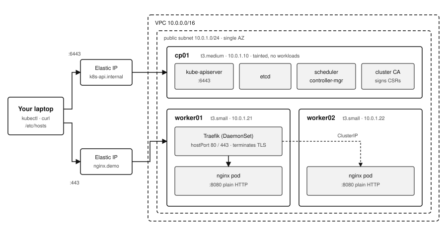

# kubeadm Kubernetes on AWS

A three-node cluster — one control plane, two workers — built with `kubeadm`
directly. No distribution wrapper, no bootstrap abstraction.

**→ [QUICK_START.md](QUICK_START.md)** — get it running in ~20 minutes
**→ [docs/DESIGN.md](docs/DESIGN.md)** — decisions, tradeoffs, and known limits

---

## What you get



| | |
|---|---|
| Cluster | kubeadm v1.36.3 — 1 control plane, 2 workers |
| Networking | Cilium CNI + Hubble, kube-proxy in iptables mode |
| Ingress | Traefik on `hostPort`, behind a dedicated Elastic IP |
| TLS | cert-manager with a self-signed CA issuer |
| Access | Users onboarded through the CSR API, not `admin.conf` |

## Commands

```
./bootstrap.sh --infra      VPC, SG, IAM role, 2 EIPs, 3 instances
               --cluster    kubeadm + CNI, then cert-manager, Traefik, RBAC
               --all        both
               --status     what exists right now
               --reset      kubeadm reset; instances stay up
               --destroy    delete the stack and everything in it

./onboard-user.sh <user> <group> [days]     issue a cert and kubeconfig via the CSR API
```

`--cluster` leaves you with a working cluster and platform. Deploying the app is
deliberately manual and done as a restricted user — see
[QUICK_START.md](QUICK_START.md).

Every flag is safe to re-run. Configuration lives in `config.env`; override it
locally with an uncommitted `config.env.local`.

## Layout

```
.
├── bootstrap.sh          dispatcher
├── config.env            single source of truth
├── infra/infra.yaml      CloudFormation: VPC, SG, IAM, key pair, EIPs, instances
├── onboard-user.sh       issue a user certificate and kubeconfig
├── libs/                 sourced or pushed, never run directly
│   ├── lib-bootstrap.sh      logging, preflight, SSH, stack-output helpers
│   ├── lib-platform.sh       cert-manager, issuers, Traefik, RBAC
│   ├── lib-users.sh          CSR onboarding steps
│   └── node/                 executed on the instances by --cluster
│       ├── 00-common.sh          swap, modules, sysctl, containerd, k8s
│       ├── 10-control-plane.sh   kubeadm init
│       ├── 20-worker-join.sh     kubeadm join
│       ├── 30-cni.sh             Cilium + Hubble
│       └── 90-reset.sh           tear the cluster down, keep the machines
├── apps/                 manifests applied to the cluster
│   ├── rbac/                 namespace, roles, group bindings
│   ├── cert-manager/         selfsigned -> CA issuer chain
│   ├── traefik/              ingress controller
│   ├── nginx/                the site, deployed by the CSR user
│   └── probe.yml             hostPort smoke test for the ingress path
└── docs/
    ├── DESIGN.md             design document
    └── img/                  diagrams (SVG)
```

## How it is built

Two phases, deliberately different:

| | Phase 1 — infrastructure | Phase 2 — cluster |
|---|---|---|
| Tool | CloudFormation | Bash over SSH |
| Idempotency | reconciled by the platform | artifact guard |
| Teardown | `delete-stack` | `kubeadm reset` |
| State | Stack Outputs | files kubeadm owns |

Declarative where the platform reconciles, imperative where it cannot —
CloudFormation has no way to know whether `kubeadm init` succeeded.

## On tooling

CloudFormation provisions machines and Bash configures them. Neither is a
Kubernetes installer. `kubeadm` is the sole mechanism that creates the cluster —
no Kubespray, k3s, RKE2, kind, or minikube appears anywhere in this repository.
