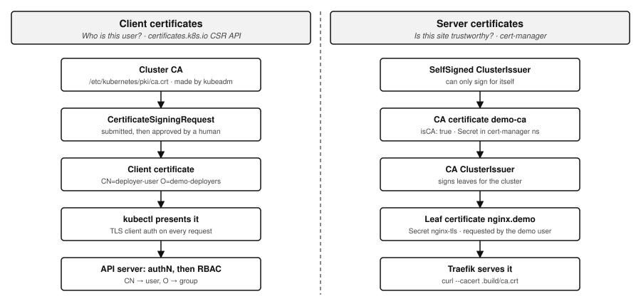
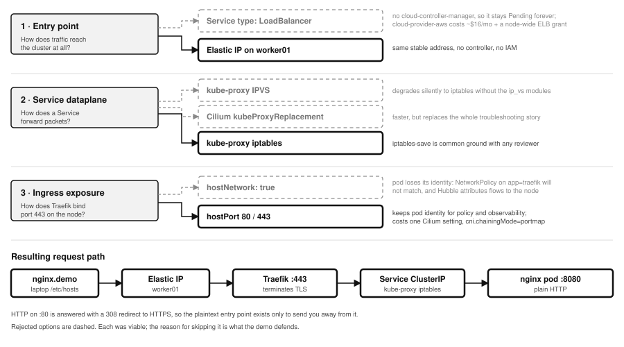
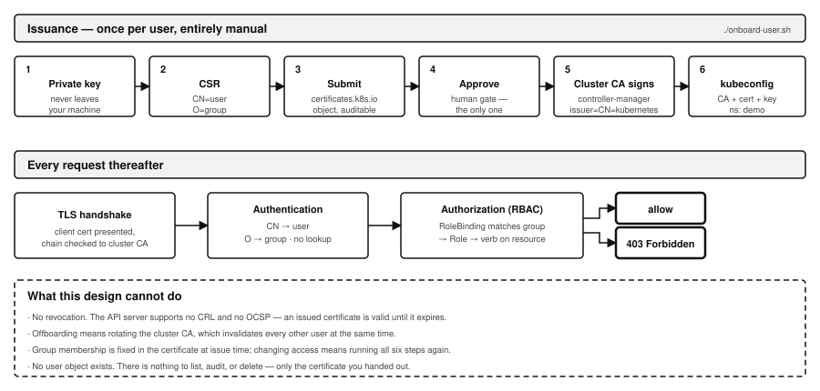

# Design

Decisions and tradeoffs. Operational steps are in [QUICK_START.md](../QUICK_START.md).

## Two phases, two tools

CloudFormation is used where the platform already reconciles desired against
actual. Bash is used where it does not: CloudFormation cannot know whether
`kubeadm init` succeeded, so cluster bootstrap guards on the artifacts kubeadm
writes — `admin.conf` for init, `kubelet.conf` for join.

Keeping kubeadm in plain shell also keeps it visible. Every command that builds
the cluster is readable in `node/`, with no indirection to explain.

**Known limits.** CloudFormation idempotency is stack-scoped, not
resource-scoped: a console edit to the security group is not reverted on the
next deploy without an explicit drift-detection call. And `kubeadm init` is
guarded, not reconciled — if the control plane is half-built, `--reset` rather
than re-running `--cluster`.

## Cost

The exercise suggests free tier. Three nodes do not fit: kubeadm preflight needs
2 vCPU and ~1700MB free memory, so `t3.micro` fails outright.

| Item | Detail | ~USD/hr |
|---|---|---|
| Control plane | `t3.medium` | 0.0416 |
| Workers ×2 | `t3.small` | 0.0208 each |
| EBS | 3 × 30GB gp3 | 0.0099 |
| Public IPv4 | 2 EIP + 1 auto-assigned | 0.0150 |
| **Total** | | **~0.108** |

**~$2.59/day**, ~$18/week. Since February 2024 AWS bills every public IPv4
address whether attached or not, which is the last line.

Local VMs would satisfy the zero-cost constraint literally. AWS was chosen for
stable public addressing — the certificate story depends on an IP that does not
change — and so a reviewer can reproduce it without matching a local hypervisor.

## Infrastructure

**Split-horizon API endpoint.** `controlPlaneEndpoint` is a hostname, not an IP.
It resolves to the private IP inside the VPC (seeded into `/etc/hosts` by
UserData) and to the Elastic IP from your laptop. Both addresses are in
`certSANs`, so one certificate serves both paths.

**Two Elastic IPs.** One on the control plane: a stop/start would otherwise
change the public IP and invalidate every `certSAN` and kubeconfig. One on
`worker01` as the ingress entry point.

The second exists because there is no cloud-controller-manager, so a `Service`
of `type: LoadBalancer` would sit `Pending` forever — nothing is running that
can call the ELB API. Installing `cloud-provider-aws` would fix that and is
entirely possible with kubeadm; it is a component nobody installed, not a
capability kubeadm lacks. Rejected on two grounds: an NLB costs ~$16/month
against a brief asking for no expense, and the IAM grant it needs would land on
the node role, where no workload isolation protects it.

A single EIP on a single worker is a SPOF. So is the single control plane. Both
are acceptable for a POC and neither is hidden.

**Instance IAM role — SSM only.** `AmazonSSMManagedInstanceCore` and nothing
else. Enough for Session Manager, which means port 22 and the key pair could be
dropped entirely. Route53 permissions for a cert-manager DNS-01 solver are
deliberately not granted: kubeadm has no IRSA, so pods inherit the node role and
every workload on the box would get DNS-write.

**Encrypted root volumes.** Account-default `aws/ebs` key. etcd lives on the
control plane volume, so this is every Secret in the cluster at rest.

**One self-referencing security group rule** covers etcd 2379-2380, kubelet
10250, controller-manager 10257, scheduler 10259, the NodePort range, and CNI
overlay traffic. Enumerating those individually is the reliable way to miss one
and lose an hour.

**Generated key pair.** CloudFormation creates it and stores the private half in
SSM Parameter Store as a SecureString; `bootstrap.sh` retrieves it to `.ssh/` at
0600. A reviewer needs no pre-existing key and nothing sensitive is committed.

**AMI from SSM Public Parameters**, resolved at deploy time so the template does
not rot.

**Static private IPs** (`10.0.1.10`, `.21`, `.22`) keep `certSANs` and hostnames
identical across rebuilds.

### Deliberate POC shortcuts

- **Workers hold public IPs.** Production would use a private subnet behind a
  bastion or SSM Session Manager.
- **`StrictHostKeyChecking=no`.** Instances are rebuilt constantly.
- **Single control plane.** No etcd quorum. `controlPlaneEndpoint` is set from
  the start, so adding members later needs no certificate regeneration.
- **No etcd backup.** A disk failure loses all cluster state.

## Two certificate systems

Frequently conflated; they share no root, no issuer, and no lifecycle.

## DNS

- **In-cluster:** CoreDNS. Nothing to configure.
- **API server:** `k8s-api.internal`, split-horizon as above.
- **The nginx site:** a laptop `/etc/hosts` entry pointing at the ingress
  Elastic IP, where Traefik binds `:80` and `:443`.

## TLS

**Default — cert-manager with a self-signed CA issuer.** A `SelfSigned` issuer
bootstraps a CA certificate, which becomes a `CA` `ClusterIssuer` signing the
site's leaf. Fully offline, deterministic, no rate limits, no domain required.
The demo shows the chain with `curl --cacert ca.crt`.

This is the default because reproducibility is scored: a reviewer can clone and
run the repo with no external dependencies.

**Alternative — real domain plus ACME.** Produces a publicly trusted
certificate. HTTP-01 needs port 80 open to the world (`PUBLIC_INGRESS_CIDR`
exists for this) and no AWS credentials. DNS-01 avoids opening port 80 but needs
Route53 write, which without IRSA means a static key in a Secret — itself a good
illustration of the credential problem this exercise is about.

`nip.io` and similar wildcard-DNS services are avoided: Let's Encrypt rate
limits are shared across every user of those domains.

**Traefik terminates TLS**, consuming the cert-manager-issued Secret; nginx
serves plain HTTP behind it. The requirements name the issuer and are silent on
the terminator, so pod-level TLS, an Ingress, and a Gateway are all compliant.
An ingress controller was chosen because it gives one stable entry point for any
number of future routes.

**On ingress-nginx.** Not used, and that is a choice rather than a constraint —
nothing in the requirements prohibits it. SIG Network and the Security Response
Committee retired the project on 24 March 2026: no releases, no bugfixes, no
security patches since. Deploying unmaintained software to terminate TLS is hard
to defend at a security company.

## Cluster networking

Three decisions at three layers. Rejected options are dashed; each was viable,
and the reason for skipping it is what the demo defends.

**CNI — Cilium.** Flannel has no NetworkPolicy support, which rules it out.
Between the rest, Cilium ships Hubble: `hubble observe --verdict DROPPED` makes
a policy denial visible in one command, and the requirements ask that users
*deploy, access and monitor* the application. Calico's equivalent observability
was historically the commercial tier.

## User access

RBAC onboarding is deliberately not automated into `bootstrap.sh`. It is kept as
a separate readable script and run live, because automating it would hide both
the mechanism and the operational toil — and the toil is the substance of the
"what is wrong with managing access this way" discussion.

Two Roles, both namespaced, bound to **groups** rather than users: `demo-deployers`
may manage the app but cannot read Secrets, `demo-viewers` may read and tail logs.
The group is the certificate's `O` field, so changing someone's access means
reissuing their certificate.
